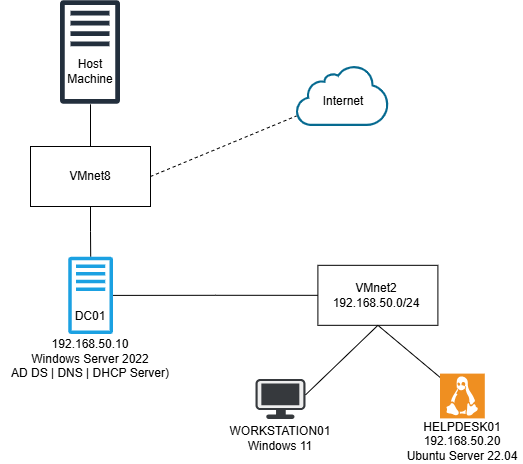

# Automated Enterprise Help Desk & User Lifecycle Lab


An ITIL-aligned, enterprise-grade service management platform built on an **osTicket** and **Active Directory (AD DS)** infrastructure. Designed to emulate production-tier IT operations, this system integrates centralized directory services, role-based access control (RBAC), multi-tier SLA enforcement, and dynamic intake schemas to demonstrate enterprise infrastructure lifecycle management.

## Executive Summary
This project, built using **VMware Workstation Pro**, establishes an enterprise helpdesk environment integrating a Linux/Apache/PHP/MySQL (**LAMP**) service desk with a Windows Server Active Directory domain controller and automates user lifecycle management combining **PowerShell** and **Python**. 

By binding osTicket directly to Active Directory via **LDAP**, the platform enforces unified identity management and automated user/agent provisioning. The environment utilizes an asynchronous Linux system daemon (`crontab`) for deterministic background task execution and SLA breach tracking, eliminating dependence on web session autocron triggers.

The primary objective was to build a secure internal network running Active Directory, deploy an open-source ticketing system, and automate repetitive Help Desk onboarding tasks using code.

## System Architecture

<picture>
  <source media="(prefers-color-scheme: dark)" srcset="diagrams/network-topology-dark.png">
  
</picture>

---

## Infrastructure Matrix

| Host Name | Operating System | IP Address | Network Adapter | Role / Services |
| :--- | :--- | :--- | :--- | :--- |
| **`DC01`** | Windows Server 2022 | `192.168.50.10` | VMnet8 (NAT) / VMnet2 (Host-Only) | Active Directory, DNS, DHCP |
| **`HELPDESK01`** | Ubuntu 22.04 LTS | `192.168.50.20` | VMnet2 (Host-Only) | osTicket Web & Database Server |
| **`WORKSTATION01`** | Windows 11 Enterprise | Dynamic (`.100+`) | VMnet2 (Host-Only) | Domain Client Workstation |

---

## Technical Features & Configuration Details

* **Unified Authentication (LDAP/AD)**: Active Directory integration allows agents (`asmith`) and end-users (`jdoe`) to log in using native domain credentials.
* **Role-Based Access Control (RBAC)**: Configured a 4-tier departmental hierarchy (`Tier 1 - Service Desk`, `Tier 2 - Field Support`, `Systems & Infrastructure`, `Networks & Operations`). Permissions enforce strict least-privilege boundaries (limiting ticket deletion while permitting linking, merging, and referral operations).
* **Service Level Agreement (SLA) Matrix**: Configured 4 master SLA plans mapped across 24/7 runtime schedules:
  * **Critical Incident SLA**: 1-Hour Grace Period
  * **Infrastructure Outage SLA**: 4-Hour Grace Period
  * **Standard System SLA**: 12-Hour Grace Period
  * **Service Request SLA**: 48-Hour Grace Period
* **Dynamic Data Schema**: Custom intake forms utilizing structured `key:value` database definitions and strict variable naming conventions (`user_id`, `asset_tag`, `software_name`, `connection_type`) to standardize ticket metadata intake. 

## Repository Structure

```text
├── docs/
│   ├── 01-virtual-network-setup.md     # Hypervisor & Virtual Network Config
│   ├── 02-active-directory-config.md   # AD DS, Organizational Units & GPOs
│   └── 03-osticket-setup.md            # osTicket Installation & Service Config
├── scripts/
│   ├── New-ADUsersFromCSV.ps1          # Automated AD Provisioning Script
│   └── users-template.csv              # Sample onboarding CSV data
├── diagrams/
│   ├── network-topology-dark.png       # Network Diagram for dark mode
│   └── network-topology-light.png      # Network Diagram for light mode
└── README.md                           # Main Project Overview
```

## Documentation Links

1. Virtual Infrastructure & Networking Setup *(Coming Soon)*
2. Active Directory & GPO Configuration *(Coming Soon)*
3. osTicket Deployment & Service Desk Setup *(Coming Soon)*

## Replication summary
1. **Deploy Active Directory**: Provision Windows Server 2022 and Windows 11 Enterprise, configure sys.lab.local, and build target OUs.

2. **Provision Web Server**: Install Ubuntu Server, deploy Apache, PHP 8.1, and MySQL. 

3. **Deploy osTicket**: Install osTicket, configure the `php-ldap` extension, and complete the database installation wizard.

4. **Bind Directory Services**: Enable the LDAP/Active Directory plugin in osTicket, set the bind credentials, and map `sAMAccountName` and `EmailAddress` attributes.

5. **Configure ITIL Workflow**: Create the 4 Departments, 4 SLA Plans, 4 Custom Forms, and map all 8 Help Topics.

6. **Enable System Cron**: Disable `Fetch on auto-cron` in the web panel and add the background cron job to the `www-data` system `crontab`:
```title="Bash"
*/5 * * * * /usr/bin/php /var/www/html/api/cron.php > /dev/null 2>&1
```

## Author
* **Tyson Bryant** — [GitHub](https://github.com/tysonfromearth) | [LinkedIn](https://www.linkedin.com/in/tysonfromearth/)
